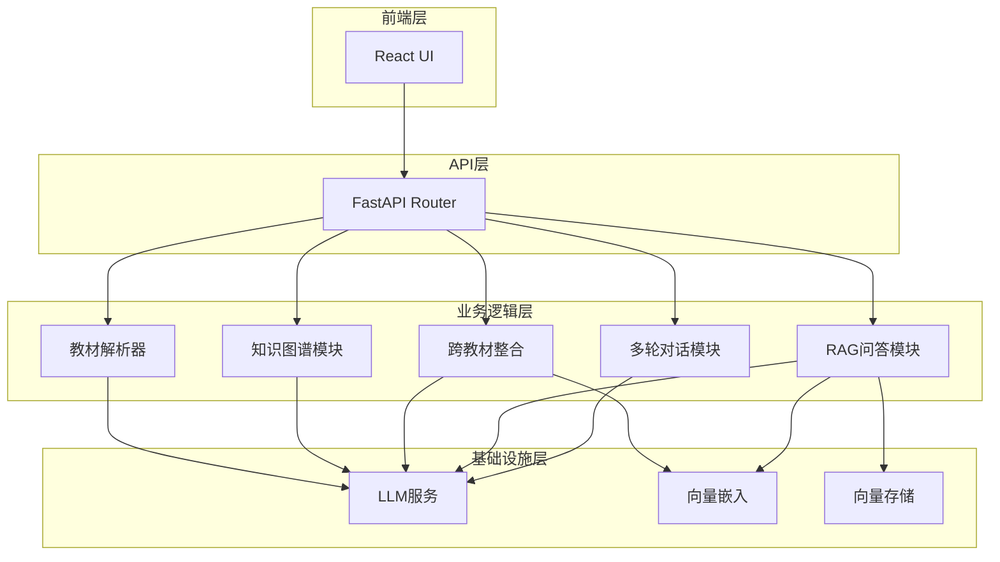

# Agent架构说明

## 1. 架构总览

学科知识整合智能体采用**多Agent协作架构**，由6个核心模块组成，各模块职责明确，通过API接口进行通信。



## 2. 模块职责

### 2.1 教材解析器（Parser）

**职责**：将PDF、Markdown、TXT、DOCX格式的教材文件解析为结构化数据。

**核心功能**：
- 多格式文件解析
- 章节识别和分割
- 元数据提取（标题、页码、字数）

**技术实现**：
- 使用pdfplumber解析PDF
- 使用python-docx解析DOCX
- 使用正则表达式识别章节结构

### 2.2 知识图谱模块（KG）

**职责**：从教材内容中提取知识点和关系，构建可视化知识图谱。

**核心功能**：
- 知识点提取（名称、定义、分类、章节）
- 关系提取（前置依赖、并列关系、包含关系、应用关系）
- 图谱存储和查询
- 节点和关系更新

**技术实现**：
- 使用LLM进行知识点提取
- 使用Pydantic模型定义数据结构
- 使用JSON文件持久化存储

### 2.3 跨教材整合模块（Integration）

**职责**：将多本教材的知识图谱进行语义对齐和整合决策。

**核心功能**：
- 语义对齐（基于嵌入相似度 + LLM验证）
- 整合决策生成（合并、保留、删除）
- 压缩比控制（不超过30%）
- 整合统计

**技术实现**：
- 使用sentence-transformers进行文本嵌入
- 使用余弦相似度计算语义相似度
- 使用LLM生成决策理由

### 2.4 RAG问答模块（RAG）

**职责**：基于教材内容进行精准问答，每个回答附带原文引用。

**核心功能**：
- 文档分块（500-800字，50-100字重叠）
- 向量嵌入和索引
- 语义检索（top-5最相关chunk）
- 答案生成（带引用来源）

**技术实现**：
- 使用sentence-transformers进行向量嵌入
- 使用FAISS进行向量存储和检索
- 使用LLM生成带引用的答案

### 2.5 多轮对话模块（Dialogue）

**职责**：支持教师通过自然语言与系统交互，修改整合决策。

**核心功能**：
- 对话历史管理
- 整合决策解释
- 用户反馈处理
- 知识图谱实时更新

**技术实现**：
- 使用JSON文件持久化对话历史
- 使用LLM生成智能回复
- 使用上下文管理器维护对话状态

### 2.6 前端界面（UI）

**职责**：提供用户友好的Web界面，支持所有功能模块的交互。

**核心功能**：
- 教材上传和管理
- 知识图谱可视化（ECharts）
- 整合操作和结果展示
- RAG问答界面
- 多轮对话界面

**技术实现**：
- 使用React 19 + TypeScript
- 使用Ant Design组件库
- 使用ECharts进行图谱可视化

## 3. 设计决策论证

### 3.1 为什么采用多Agent架构？

**问题**：单Agent架构会导致：
1. Prompt复杂度过高，难以维护
2. 上下文长度限制，无法处理长文档
3. 模块间耦合度高，难以独立开发和测试

**解决方案**：采用多Agent架构，每个模块职责单一，通过API接口通信。

**优势**：
1. 模块独立开发和测试
2. 可以针对不同任务优化不同模型
3. 易于扩展和维护

### 3.2 为什么选择FAISS作为向量数据库？

**考虑因素**：
1. 轻量级，易于部署
2. 高效的向量检索
3. 支持持久化存储
4. 免费开源

**对比分析**：
- ChromaDB：功能更丰富，但资源消耗更大
- Milvus：适合大规模生产环境，但部署复杂
- FAISS：适合中小规模应用，性能优异

### 3.3 为什么选择sentence-transformers作为嵌入模型？

**考虑因素**：
1. 支持中文语义理解
2. 本地运行，无需API调用
3. 模型体积小，加载快
4. 社区活跃，文档完善

**对比分析**：
- OpenAI Embedding：效果好，但需要API调用，有成本
- BGE-small-zh：中文效果好，但模型较大
- paraphrase-multilingual-MiniLM-L12-v2：多语言支持，体积小，性能均衡

## 4. 数据流与调用链路

### 4.1 完整流程

```
用户上传教材
    ↓
教材解析器 → 生成结构化数据
    ↓
知识图谱模块 → 提取知识点和关系
    ↓
跨教材整合 → 语义对齐 + 整合决策
    ↓
RAG问答模块 → 建立向量索引
    ↓
用户提问 → 语义检索 → 答案生成
    ↓
多轮对话 → 解释决策 → 处理反馈
```

### 4.2 关键接口

**教材上传**：
- 输入：文件流
- 输出：file_id, filename, size

**知识图谱提取**：
- 输入：file_id
- 输出：task_id（异步）

**跨教材整合**：
- 输入：textbook_ids
- 输出：task_id（异步）

**RAG问答**：
- 输入：question
- 输出：answer, citations, source_chunks

**多轮对话**：
- 输入：message, conversation_id
- 输出：response, suggestions

## 5. 取舍与权衡

### 5.1 放弃的方案

**方案1：使用GPT-4进行所有LLM调用**
- 原因：成本高，响应慢
- 替代方案：使用通义千问API，成本低，响应快

**方案2：使用Milvus作为向量数据库**
- 原因：部署复杂，资源消耗大
- 替代方案：使用FAISS，轻量级，易于部署

**方案3：实现实时流式响应**
- 原因：开发时间有限
- 替代方案：使用异步任务，轮询状态

### 5.2 已知局限

1. **单机部署**：不支持分布式，无法处理大规模并发
2. **内存存储**：部分状态存储在内存，重启后需要重建
3. **无用户认证**：不支持多用户隔离
4. **无实时协作**：不支持多人同时编辑

### 5.3 改进方向

如果有更多时间，可以改进：

1. **引入Redis**：用于状态缓存和会话管理
2. **添加用户认证**：支持多用户和权限管理
3. **实现流式响应**：提升用户体验
4. **优化LLM调用**：实现批量处理和缓存
5. **添加监控告警**：实时监控系统状态

## 6. 技术栈总结

| 层级 | 技术 | 用途 |
|------|------|------|
| 前端 | React 19 + TypeScript | 用户界面 |
| UI组件 | Ant Design | 组件库 |
| 图表 | ECharts | 知识图谱可视化 |
| 后端 | FastAPI | API服务 |
| LLM | 通义千问 API | 知识提取、问答、对话 |
| 嵌入 | sentence-transformers | 文本向量化 |
| 向量库 | FAISS | 向量存储和检索 |
| 文件解析 | pdfplumber, python-docx | 教材解析 |
| 数据验证 | Pydantic | 数据模型 |

## 7. 总结

学科知识整合智能体采用多Agent协作架构，各模块职责明确，通过API接口通信。系统核心功能包括：

1. **多格式教材解析**：支持PDF、Markdown、TXT、DOCX
2. **知识图谱构建**：自动提取知识点和关系
3. **跨教材整合**：语义对齐 + 整合决策 + 压缩比控制
4. **RAG精准问答**：基于教材内容的问答，带引用来源
5. **多轮对话**：支持自然语言交互和反馈处理

系统设计遵循高内聚、低耦合原则，易于扩展和维护。
