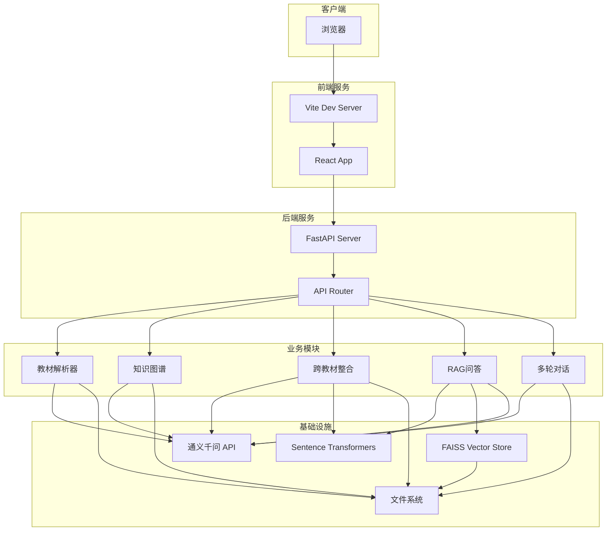
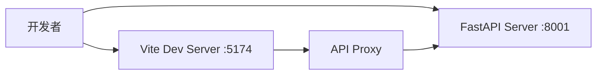
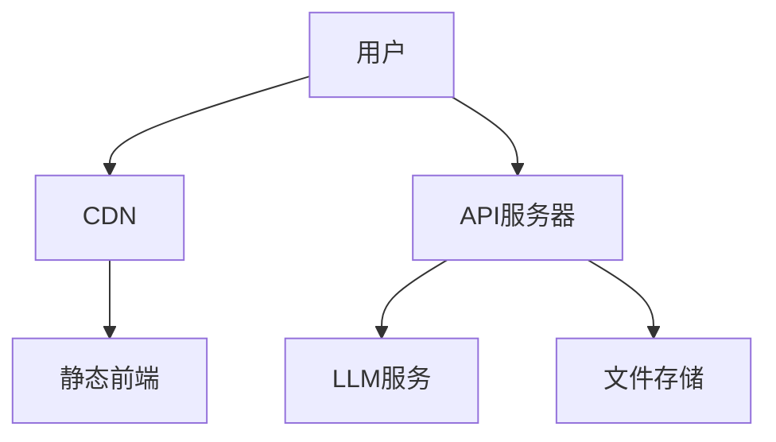

# 系统设计文档

## 1. 系统架构图



## 2. 数据流设计

### 2.1 教材上传流程

```
用户上传文件
    ↓
前端验证（格式、大小）
    ↓
调用 POST /api/upload
    ↓
后端保存文件到 data/textbooks/
    ↓
异步触发解析任务
    ↓
返回 file_id
    ↓
前端轮询解析状态
    ↓
解析完成，更新文件列表
```

### 2.2 知识图谱构建流程

```
用户选择教材，点击"提取知识图谱"
    ↓
调用 POST /api/kg/extract
    ↓
后端加载已解析的教材数据
    ↓
调用LLM提取知识点和关系
    ↓
保存知识图谱到 data/kg/
    ↓
返回 task_id
    ↓
前端轮询提取状态
    ↓
提取完成，渲染图谱
```

### 2.3 跨教材整合流程

```
用户选择多本教材，点击"开始整合"
    ↓
调用 POST /api/integration/merge
    ↓
后端加载所有教材的知识图谱
    ↓
计算嵌入相似度，筛选候选对
    ↓
调用LLM验证等价性
    ↓
生成整合决策（合并/保留/删除）
    ↓
计算压缩比，优化策略
    ↓
保存整合结果
    ↓
返回 task_id
    ↓
前端轮询整合状态
    ↓
整合完成，展示结果
```

### 2.4 RAG问答流程

```
用户输入问题
    ↓
调用 POST /api/rag/query
    ↓
计算问题的嵌入向量
    ↓
在FAISS中检索top-5相似chunk
    ↓
将chunk作为上下文，调用LLM生成答案
    ↓
提取引用来源
    ↓
返回答案和引用
    ↓
前端展示答案，支持展开引用
```

### 2.5 多轮对话流程

```
用户输入消息
    ↓
调用 POST /api/dialogue/chat
    ↓
加载对话历史
    ↓
构建上下文
    ↓
调用LLM生成回复
    ↓
保存对话历史
    ↓
返回回复和建议
    ↓
前端展示回复
```

## 3. 技术选型

### 3.1 前端技术栈

| 技术 | 版本 | 用途 | 选择理由 |
|------|------|------|----------|
| React | 19 | UI框架 | 组件化、生态丰富 |
| TypeScript | 5.x | 类型安全 | 提高代码质量 |
| Vite | 6.x | 构建工具 | 快速热重载 |
| Ant Design | 5.x | UI组件库 | 企业级组件 |
| ECharts | 5.x | 图表库 | 知识图谱可视化 |
| Axios | 1.x | HTTP客户端 | 简洁易用 |

### 3.2 后端技术栈

| 技术 | 版本 | 用途 | 选择理由 |
|------|------|------|----------|
| Python | 3.10+ | 编程语言 | AI生态丰富 |
| FastAPI | 0.115+ | Web框架 | 高性能、自动文档 |
| Pydantic | 2.x | 数据验证 | 类型安全、序列化 |
| uvicorn | 0.34+ | ASGI服务器 | 高性能 |

### 3.3 AI/ML技术栈

| 技术 | 版本 | 用途 | 选择理由 |
|------|------|------|----------|
| 通义千问 API | - | LLM服务 | 中文效果好、成本低 |
| sentence-transformers | 3.x | 文本嵌入 | 多语言支持、本地运行 |
| FAISS | 1.x | 向量数据库 | 高性能、轻量级 |
| NumPy | 2.x | 数值计算 | 基础依赖 |

### 3.4 文件解析技术栈

| 技术 | 版本 | 用途 | 选择理由 |
|------|------|------|----------|
| pdfplumber | 0.11+ | PDF解析 | 提取文本和表格 |
| python-docx | 1.x | DOCX解析 | 读取Word文档 |
| markdown | 3.x | Markdown解析 | 转换为HTML |
| BeautifulSoup4 | 4.x | HTML解析 | 提取文本内容 |

## 4. API接口设计

### 4.1 教材管理API

#### 上传教材
```
POST /api/upload/
Content-Type: multipart/form-data

Request:
- file: 文件流

Response:
{
  "file_id": "uuid",
  "filename": "生理学.pdf",
  "size": 1024000,
  "message": "File uploaded successfully"
}
```

#### 获取文件列表
```
GET /api/files/

Response:
[
  {
    "file_id": "uuid",
    "filename": "生理学.pdf",
    "parse_status": "completed",
    "chapter_count": 12,
    "total_chars": 180000
  }
]
```

#### 查询解析状态
```
GET /api/parse/status/{file_id}

Response:
{
  "file_id": "uuid",
  "status": "completed",
  "chapter_count": 12,
  "total_chars": 180000
}
```

### 4.2 知识图谱API

#### 提取知识图谱
```
POST /api/kg/extract
Content-Type: application/json

Request:
{
  "file_id": "uuid"
}

Response:
{
  "file_id": "uuid",
  "message": "Knowledge extraction started"
}
```

#### 获取知识图谱
```
GET /api/kg/graph/{file_id}?page=1&page_size=100&category=核心概念

Response:
{
  "nodes": [...],
  "links": [...],
  "pagination": {
    "page": 1,
    "page_size": 100,
    "total": 500,
    "total_pages": 5
  }
}
```

#### 更新节点
```
PUT /api/kg/graph/{file_id}/node/{node_id}
Content-Type: application/json

Request:
{
  "name": "新名称",
  "definition": "新定义"
}

Response:
{
  "message": "Node updated successfully"
}
```

### 4.3 跨教材整合API

#### 启动整合
```
POST /api/integration/merge
Content-Type: application/json

Request:
{
  "textbook_ids": ["uuid1", "uuid2", "uuid3"]
}

Response:
{
  "task_id": "integration_xxx",
  "message": "Integration started for 3 textbooks"
}
```

#### 查询整合状态
```
GET /api/integration/status/{task_id}

Response:
{
  "task_id": "integration_xxx",
  "status": "completed",
  "progress": 100.0
}
```

#### 获取整合决策
```
GET /api/integration/decisions/{task_id}

Response:
[
  {
    "decision_id": "decision_xxx",
    "action": "merge",
    "affected_nodes": ["node1", "node2"],
    "result_node": "node1",
    "reason": "两个知识点描述相同概念",
    "confidence": 0.95
  }
]
```

#### 获取整合统计
```
GET /api/integration/statistics/{task_id}

Response:
{
  "original_textbook_count": 7,
  "total_original_chars": 1250000,
  "total_compressed_chars": 350000,
  "compression_ratio": 0.28,
  "total_decisions": 156,
  "merge_count": 68,
  "keep_count": 52,
  "remove_count": 36
}
```

### 4.4 RAG问答API

#### 建立索引
```
POST /api/rag/index
Content-Type: application/json

Request:
{
  "file_ids": ["uuid1", "uuid2"]
}

Response:
{
  "task_id": "index_xxx",
  "message": "Indexing started for 2 files"
}
```

#### 提问
```
POST /api/rag/query
Content-Type: application/json

Request:
{
  "question": "什么是炎症？"
}

Response:
{
  "answer": "炎症是具有血管系统的活体组织对各种损伤因子的刺激所发生的防御性反应...",
  "citations": [
    {
      "chunk_id": "chunk_xxx",
      "textbook": "病理学",
      "chapter": "第四章 炎症",
      "page": 78,
      "content": "炎症(inflammation)是具有血管系统的活体组织...",
      "relevance_score": 0.92
    }
  ],
  "source_chunks": [...]
}
```

#### 查询索引状态
```
GET /api/rag/status

Response:
{
  "total_chunks": 2500,
  "indexed_textbooks": 7,
  "is_ready": true
}
```

### 4.5 多轮对话API

#### 发送消息
```
POST /api/dialogue/chat
Content-Type: application/json

Request:
{
  "message": "为什么合并这两个知识点？",
  "conversation_id": "conv_xxx"
}

Response:
{
  "conversation_id": "conv_xxx",
  "response": "这两个知识点都描述了'炎症'的概念...",
  "suggestions": ["查看所有整合决策", "修改这个决策"]
}
```

#### 提交反馈
```
POST /api/dialogue/feedback
Content-Type: application/json

Request:
{
  "conversation_id": "conv_xxx",
  "decision_id": "decision_xxx",
  "feedback_type": "modify",
  "content": "请保留病理学的定义"
}

Response:
{
  "success": true,
  "message": "反馈已收到，系统将根据反馈调整整合方案"
}
```

#### 获取对话历史
```
GET /api/dialogue/history/{conversation_id}

Response:
{
  "conversation_id": "conv_xxx",
  "messages": [
    {
      "role": "user",
      "content": "为什么合并这两个知识点？",
      "timestamp": "2026-05-11T10:30:00"
    },
    {
      "role": "assistant",
      "content": "这两个知识点都描述了'炎症'的概念...",
      "timestamp": "2026-05-11T10:30:05"
    }
  ]
}
```

## 5. 数据模型设计

### 5.1 教材模型

```python
class Chapter(BaseModel):
    chapter_id: str
    title: str
    page_start: int
    page_end: int
    content: str
    char_count: int

class Textbook(BaseModel):
    textbook_id: str
    filename: str
    title: str
    total_pages: int
    total_chars: int
    chapters: List[Chapter]
    parsed_at: datetime
```

### 5.2 知识图谱模型

```python
class KnowledgeNode(BaseModel):
    id: str
    name: str
    definition: str
    category: str
    chapter: str
    chapter_id: str
    page: int
    textbook_id: str
    frequency: int

class KnowledgeRelation(BaseModel):
    source: str
    target: str
    relation_type: str
    description: str
    confidence: float

class KnowledgeGraph(BaseModel):
    textbook_id: str
    textbook_title: str
    nodes: List[KnowledgeNode]
    relations: List[KnowledgeRelation]
    total_nodes: int
    total_relations: int
    extracted_at: datetime
```

### 5.3 整合决策模型

```python
class IntegrationDecision(BaseModel):
    decision_id: str
    action: str  # merge, keep, remove
    affected_nodes: List[str]
    result_node: Optional[str]
    reason: str
    confidence: float
    created_at: datetime
```

### 5.4 对话消息模型

```python
class Message(BaseModel):
    role: str  # user, assistant
    content: str
    timestamp: datetime
    metadata: Dict[str, Any]
```

## 6. 目录结构设计

```
zju-hackerson-agent-design/
├── frontend/                    # 前端代码
│   ├── src/
│   │   ├── components/          # 组件
│   │   │   ├── FileList.tsx
│   │   │   ├── FileUpload.tsx
│   │   │   ├── KnowledgeGraphPanel.tsx
│   │   │   ├── IntegrationTab.tsx
│   │   │   ├── RAGTab.tsx
│   │   │   └── DialogueTab.tsx
│   │   ├── pages/               # 页面
│   │   ├── api/                 # API调用
│   │   └── App.tsx
│   ├── public/
│   └── package.json
│
├── src/                         # 后端代码
│   ├── api/
│   │   ├── router.py            # 路由注册
│   │   └── routes/              # API端点
│   │       ├── upload.py
│   │       ├── files.py
│   │       ├── parse.py
│   │       ├── kg.py
│   │       ├── integration.py
│   │       ├── rag.py
│   │       └── dialogue.py
│   ├── parsers/                 # 教材解析器
│   ├── kg/                      # 知识图谱模块
│   ├── integration/             # 跨教材整合
│   │   ├── alignment.py
│   │   ├── decision.py
│   │   └── compression.py
│   ├── rag/                     # RAG问答
│   │   ├── chunking.py
│   │   └── qa.py
│   ├── dialogue/                # 多轮对话
│   │   └── context.py
│   ├── embedding/               # 向量嵌入
│   │   └── service.py
│   ├── vectorstore/             # 向量存储
│   │   └── faiss_store.py
│   ├── llm/                     # LLM调用
│   ├── models/                  # 数据模型
│   ├── shared/                  # 共享工具
│   │   └── config.py
│   └── main.py                  # 应用入口
│
├── tests/                       # 测试文件
│   ├── test_graph_store.py
│   ├── test_integration.py
│   ├── test_rag.py
│   └── test_dialogue.py
│
├── docs/                        # 文档
│   ├── Agent架构说明.md
│   ├── 需求分析.md
│   ├── 系统设计.md
│   └── 接口文档.md
│
├── report/                      # 报告
│   └── 整合报告.md
│
├── data/                        # 数据目录
│   ├── textbooks/               # 教材文件
│   ├── kg/                      # 知识图谱
│   ├── integration/             # 整合结果
│   ├── vectorstore/             # 向量索引
│   └── dialogue/                # 对话历史
│
├── requirements.txt             # Python依赖
├── package.json                 # 前端依赖
├── .env.example                 # 环境变量示例
├── .gitignore                   # Git忽略配置
└── README.md                    # 项目说明
```

## 7. 部署架构

### 7.1 开发环境



### 7.2 生产环境



### 7.3 Docker部署

```yaml
version: '3.8'

services:
  frontend:
    build:
      context: ./frontend
      dockerfile: Dockerfile
    ports:
      - "5174:80"
    depends_on:
      - backend

  backend:
    build:
      context: .
      dockerfile: Dockerfile
    ports:
      - "8001:8001"
    volumes:
      - ./data:/app/data
    environment:
      - DASHSCOPE_API_KEY=${DASHSCOPE_API_KEY}
```

## 8. 总结

本系统设计文档详细描述了学科知识整合智能体的架构、数据流、技术选型、API接口、数据模型和部署方案。

系统采用前后端分离架构，前端使用React + TypeScript，后端使用FastAPI + Python。核心功能包括教材解析、知识图谱构建、跨教材整合、RAG问答和多轮对话。

系统设计遵循高内聚、低耦合原则，易于扩展和维护。
